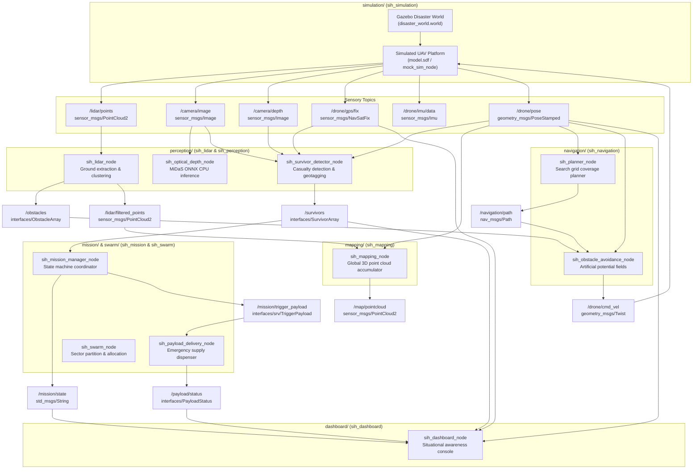

# SIH26177 Autonomous Search-and-Rescue UAV Architecture

## Architectural Decoupling Principles

1. **Separation of Physics and Computation**:
   Nodes subscribe only to standard sensory ROS 2 topics (`/lidar/points`, `/camera/image`, etc.). They have no hard-coded dependencies on Gazebo. Replacing Gazebo with real hardware is zero-code-change at the algorithm layer.
2. **CPU-First & Raspberry Pi 4 Ready**:
   All perception and navigation algorithms are designed for single-thread and multi-core CPU execution. Deep learning uses quantized/lightweight ONNX models (`MiDaS v2.1 Small`) with inference latencies under 100 ms on CPU.
3. **Independent Demonstrability**:
   Every package has a standalone executable mode and an independent ROS 2 launch file.
